  
  
  
  # ¡Hola! Soy Lucas Palacios Kantor 👋
  ### Software Engineer from Chile 🇨🇱
  
  
  
  

## 👨‍💻 Sobre mí

Software Engineer con enfoque en construir **soluciones óptimas, escalables y sostenibles en el tiempo**, entendiendo profundamente el problema de negocio y trabajando en conjunto con producto.  
Me apasiona el deporte, los videojuegos, el gimnasio y compartir con mi familia y amigos. Disfruto ir más allá de solo programar: **diseñar soluciones creativas alineadas a lo que realmente necesitan los clientes**.

- 🔭 Actualmente trabajando como **Semi-Senior Software Engineer en Buk**
- 🧠 Especializado en **ingeniería de software end-to-end**, desde el diseño hasta la implementación
- 🤖 Fuerte interés en **IA aplicada al desarrollo** y generación de soluciones
- 🌱 Stack principal: **Ruby on Rails, Python, TypeScript, JavaScript**
- 📍 Santiago, Chile 🇨🇱

## 💼 Experiencia Profesional

**Semi-Senior Software Engineer**  
**Buk** – Equipo de *Seguridad y Salud en el Trabajo y Cumplimiento*

- Desarrollo de soluciones robustas y mantenibles en sistemas productivos
- Enfoque en diseño técnico considerando impacto, escalabilidad y expectativas del negocio
- Trabajo cercano con producto para traducir requerimientos en soluciones técnicas claras
- Uso activo de herramientas de IA para acelerar desarrollo y mejorar calidad

## 🤖 IA en Desarrollo

Uso frecuente de herramientas de IA como parte del flujo de trabajo:

- ChatGPT
- Claude Code
- Cursor
- GitHub Copilot

Aplicadas tanto a **diseño de soluciones**, exploración técnica como optimización del desarrollo.

## 📊 Estadísticas de GitHub

  
  

## 🎓 Educación

**Ingeniería Civil Industrial**  
*Diploma en Tecnologías de la Información*  
*Distinción*  
**Egreso:** 2024

## 🌍 Idiomas

- Español: Nativo  
- Inglés: Nativo  
  - Colegio bilingüe  
  - International Baccalaureate – English HL aprobado

## 🛠️ Tecnologías y Herramientas

### Backend Development

  
  
  
  

### Frontend Development

  
  
  
  
  

### Bases de Datos

  

### Cloud & Tools

  
  
  
  

---

  
  ### 💬 "Good software is built by understanding the problem first."
  
  
  

